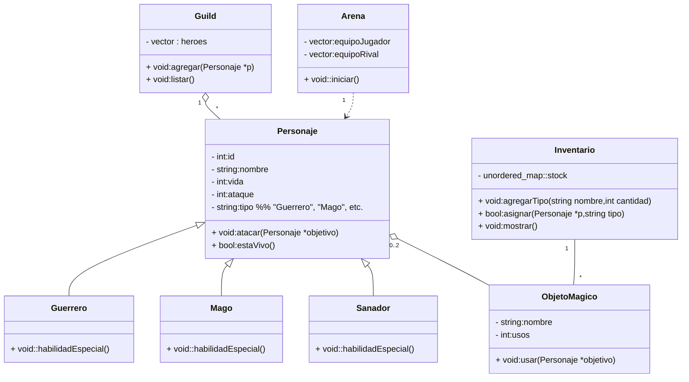
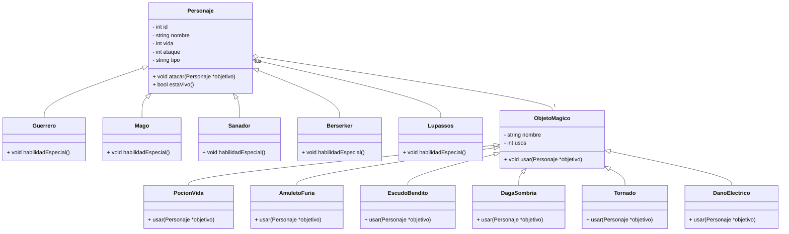
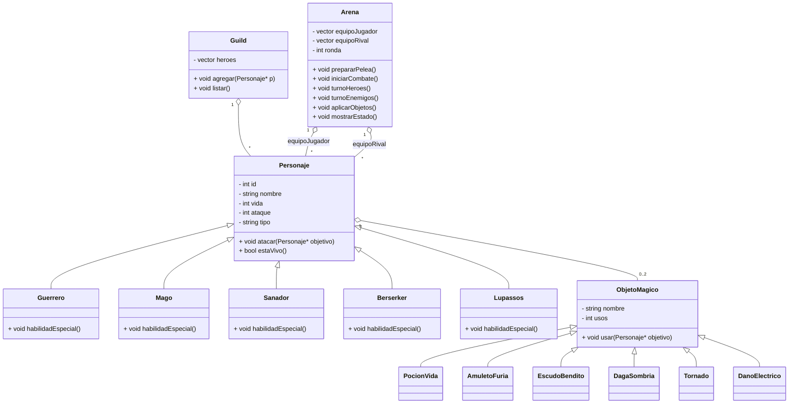

# README — El gran torneo de la arena

---
En este proyecto se crea juego/simulador por turnos en C++, que hacen parte de un “Gran Torneo”. Se hizo con el objetivo en mente de implementar los principios y fundamentos de la Programacion Orientada a Objetos: herencia, polimorfismo, clases, gestión de inventario con stock global, uso de objetos mágicos en combate, y persistencia simple en JSON. Se juega mediante la interfaz directamente por la consola/terminal.

---
## Indice

1. Descripción general
2. Características principales
3. Estructura del repositorio (qué archivo hace qué)
4. Flujo de uso / ejemplos de uso en consola
5. Inventario y objetos (cómo funcionan en pre-combate, combate y post-combate)
6. Arena / Combate (lógica general)
7. Persistencia (JSON)
8. UMLs
9. Imágenes y evidencia que debes capturar

---

## 1) Descripción general

El codigo simula enfrentamientos por turnos entre un equipo de héroes (que sería el Guild) y los enemigos.

* Cada personaje jugable tiene ciertos Atributos: `id`, `nombre`, `nivel`, `vida`, `ataque`, `defensa`, y `rol` (que van determinado su comportamiento).
* Hay clases base (`Personaje`) y subclases hijas (`Guerrero`, `Mago`, `Sanador`, `Paladin`, `Arquero`, `Asesino`, etc.).
* Un `Inventario` encargado de gestionar las **categorías** de objetos mágicos. Antes del combate se asignan objetos a héroes; en combate solo pueden usarlos una vez por batalla y una vez usados se eliminan del inventario global.
* `Arena` es basicamente el motor de combate: recibe los participantes y corre por medio de turnos (primero todos los héroes, luego los enemigos).
* La persistencia de héroes se realiza con JSON (archivo `heroes_guardados.json`), para poder cargar/guardar configuraciones.

---

## 2) Características principales

* Usa la Interfaz por consola de manera interactiva (el usuario decide acciones de sus héroes por turno).
* El Inventario con stock global y clonación de prototipos (patrón prototipo simple).
* Objetos con efectos aleatorios (ej. la `pociónVida` puede curar entre 20–40 vida).
* Tiene un comportamiento simple para los oponentes (ataques con probabilidad de fallo/crit).
* Persistencia en JSON (guardar/cargar heroes).
* Todos los textos en consola sin tildes ni letra ñ (para evitar problemas visuales en la interfaz).

---

## 3) Estructura del repositorio (archivos más relevantes)

```
/ (raiz)
  CMakeLists.txt
  main.cpp
  PROYECTO_FINAL.pdf
  README.md
  BITACORA.md
/src
  Arena.h / Arena.cpp            // motor de combate
  Guild.h / Guild.cpp            // gestion de heroes y enemigos
  Personaje.h / Personaje.cpp    // clase base
  Heroe.h / Heroe.cpp            // heroe + subtipos (Guerrero, Mago, ...)
  Oponente.h / Oponente.cpp      // enemigos
  Inventario.h / Inventario.cpp  // catalogo/categorias y stock global
  ObjetoMagico.h / ObjetoMagico.cpp // prototipos y objetos concretos (PocionVida, AmuletoFuria, etc.)
  PersistenciaHeroesJSON.h / .cpp // guardar / cargar
  json.hpp                       // single-header nlohmann::json
  ... (otros objetos y clases)
```

---


## 4) Uso: menú, flujo e interacciones (ejemplo)

Al ejecutar verás un menú principal con opciones como:

```
1) Gestionar Guild (listar/agregar/retirar)
2) Gestionar Inventario (crear/listar/consultar/actualizar/eliminar)
3) Asignar/Retirar objetos a heroes (PRE-COMBATE)
4) Iniciar combate (interactivo)
5) Guardar heroes (JSON)
6) Cargar heroes desde JSON
7) Salir
```

Flujo típico:

1. `2) Gestionar Inventario` — crear categorias (ej. `pocion_vida`) y stock.
2. `1) Gestionar Guild` — ver heroes precargados o agregar nuevos.
3. `3) Asignar/Retirar objetos` — asignar objetos a héroes antes del combate (se decrementa stock).
4. `4) Iniciar combate` — combate por turnos: para cada heroe vivo eliges atacar / usar objeto / habilidad.
5. Al finalizar la batalla se muestra resumen (equipo ganador, heroes supervivientes, turnos, objetos usados).

**Salida de ejemplo (fragmento):**

```
--- TURNO 3 (ENEMIGOS) ---
Trol golpe critico! Danio: 34
...
=== FIN DEL COMBATE ===
Equipo ganador: Guild del jugador
Heroes supervivientes: Aldric, Lyra
Duracion: 9 turnos
Objetos usados: 3
```

---

## 5) Inventario y objetos (reglas concretas)

* **Antes del combate (preparacion):**

    * El jugador puede asignar o retirar objetos a sus héroes.
    * Asignar decrementa stock global; retirar devuelve stock si el objeto NO fue usado.
    * Máximo 2 objetos por héroe (ejemplo en la implementación).
* **Durante el combate:**

    * Solo los héroes con objeto asignado pueden usarlo.
    * Cada objeto tiene `usosPorCombate` (normalmente 1).
    * Al usarlo se marca como usado y su efecto se aplica (curacion, daño, buff).
* **Después del combate:**

    * Objetos usados se eliminan del inventario global (no se recuperan).
    * Objetos no usados pueden devolverse al inventario y ser reutilizados.

**Objetos implementados (ejemplos)**

* `PocionVida`: cura aleatoria entre 20–40.
* `AmuletoFuria`: +5..+10 ataque durante 2 turnos (simulado).
* `EscudoBendito`: +10..+20 defensa por 1 turno.
* `BolaHielo`, `PergaminoEnergia`, `CinturonResiliencia` (otros objetos añadidos) — ver `ObjetosMagicos.h/.cpp`.

---

## 6) Arena / Combate (lógica general)

* Combate por turnos: **turno heroes** → acciones del jugador para cada héroe vivo; luego **turno enemigos** → IA simple ataca.
* Factores aleatorios: variación de daño ±10%, probabilidad de crítico o fallo, efectos aleatorios en objetos.
* Un personaje muere cuando `vida <= 0`.
* Se chequea el fin del combate al terminar cada turno completo.
* Resumen final incluye ganador, supervivientes, número de turnos y objetos usados.

---

## 7) Persistencia en JSON

* Se guarda un listado básico de héroes (id, nombre, nivel, vida, ataque, defensa, rol, tipo) en `heroes_guardados.json` usando `json.hpp` (nlohmann::json).
* `PersistenciaHeroesJSON::guardar(guild, ruta)` y `::cargar(guild, ruta)` realizan respectivamente la escritura y la reconstrucción simple de la guild (reconstruye classes por `tipo`).

> Nota: por simplicidad solo se persisten los héroes (no todo el estado del inventario ni el estado de objetos asignados). Si quieres persistir inventario/objetos asignados, hay que serializar también `Inventario` y las instancias de objetos (recomendado como mejora).

---

## 8) UMLs — plantillas y dónde ampliar

### UML 1 — Diagrama de clases inicial (básico)


**Primer Diagrama UML**



### UML 2 Con mejoras y mas detalles




### UML 3 y final



## 9) Imágenes y evidencia (qué capturar y cómo explicarlo)

1. **Estructura de archivos del proyecto** (`explorer` o VSCode mostrando `/src`)

    * *Explicación:* muestra la organización del código por responsabilidades (clases, inventario, arena, persistencia).

2. **Pantalla del menú principal al ejecutar**

    * *Explicación:* indica opciones disponibles y flujo de interacción.

3. **Asignación de objetos en pre-combate**

    * *Explicación:* muestra cómo disminuye stock al asignar y cómo se ve el objeto en el heroe.

4. **Combate — Turno de héroe mostrando opciones**

    * *Explicación:* evidencia interactividad (atacar, usar objeto, habilidad).

5. **Combate — Turno enemigo con golpe crítico / fallo**

    * *Explicación:* demuestra aleatoriedad y mensajes de daño.

6. **Resumen final del combate**

    * *Explicación:* ganador, supervivientes, turnos, objetos usados.

7. **Archivo JSON guardado (`heroes_guardados.json`)**

    * *Explicación:* demuestra persistencia y formato de los datos.

8. **Ejecución de una prueba de error corregida** (por ejemplo: mostrar `Guild.h` ahora encontrado tras arreglar CMake)

    * *Explicación:* evidencia las correcciones y la robustez del build.

Para cada imagen:

* Incluye el nombre del archivo (ej. `01_menu_principal.png`)
* Añade 2–3 líneas que expliquen **qué** se ve y **por qué** es relevante.

---


# proyecto_paradaise
Proyecto curso programación orientada a objetos.
