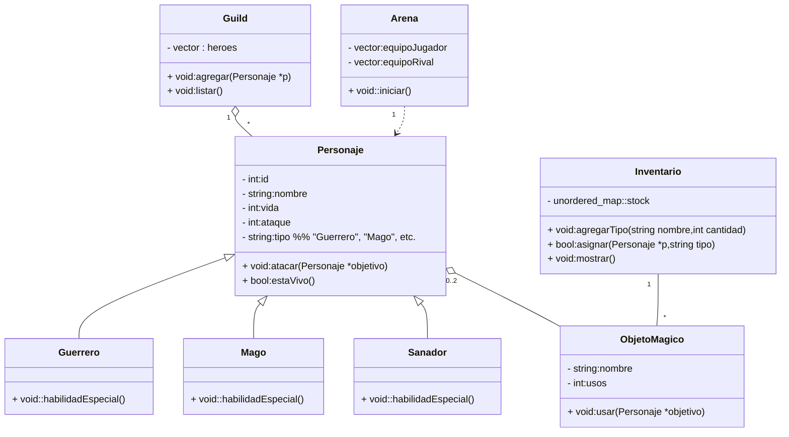

# Proyecto Final - Torneo de Rol
Proyecto curso programación orientada a objetos.

**Primer Diagrama UML**

```mermaid

classDiagram

    %% ----------- Clase base -----------
    class Personaje {
        - int:id
        - string:nombre
        - int:vida
        - int:ataque
        - string:tipo   %% "Guerrero", "Mago", etc.
        + void:atacar(Personaje *objetivo)
        + bool:estaVivo()
    }

    %% ----------- Herencia simple -----------
    Personaje <|-- Guerrero
    Personaje <|-- Mago
    Personaje <|-- Sanador

    class Guerrero {
        + void::habilidadEspecial()
    }

    class Mago {
        + void::habilidadEspecial()
    }

    class Sanador {
        + void::habilidadEspecial()
    }

    %% ----------- Objeto Magico -----------
    class ObjetoMagico {
        - string:nombre
        - int:usos
        + void:usar(Personaje *objetivo)
    }

    %% ----------- Inventario Global -----------
    class Inventario {
        - unordered_map<string,int>::stock
        + void:agregarTipo(string nombre,int cantidad)
        + bool:asignar(Personaje *p,string tipo)
        + void:mostrar()
    }

    %% ----------- Guild del jugador -----------
    class Guild {
        - vector<Personaje*> : heroes
        + void:agregar(Personaje *p)
        + void:listar()
    }

    %% ----------- Arena (Combate) -----------
    class Arena {
        - vector<Personaje*>:equipoJugador
        - vector<Personaje*>:equipoRival
        + void::iniciar()
    }

    %% ----------- Relaciones -----------
    Guild "1" o -- "*" Personaje
    Inventario "1" -- "*" ObjetoMagico
    Personaje "0..2" o-- ObjetoMagico
    Arena "1" ..> Personaje
```
